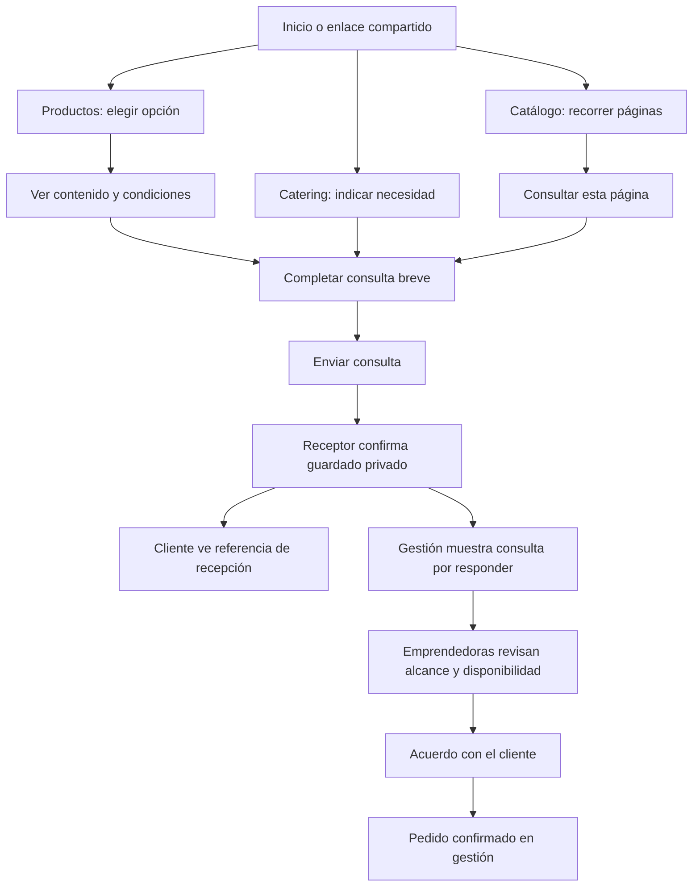
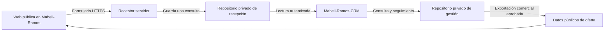

# Mabell Ramos · Plan maestro de la web para clientes

**Versión:** 1.0 · 29 de septiembre de 2026.  
**Repositorio de implementación:** `gsaco/Mabell-Ramos`.  
**Aplicación de gestión relacionada:** `gsaco/Mabell-Ramos-CRM`.  
**Estado:** especificación de referencia, con implementación y comprobación local documentadas en [IMPLEMENTACION_WEB.md](IMPLEMENTACION_WEB.md). La recepción de producción, las validaciones comerciales y el piloto requieren la configuración y participación indicadas en esa guía. Este documento no acredita productos, precios ni servicios nuevos como disponibles.

## 1. Decisión de producto y alcance

Crear una web breve, cálida y clara que permita **elegir una opción de productos, consultar por un evento o recorrer el catálogo**. Su navegación principal tendrá únicamente **Productos · Catering · Catálogo**. El logo permitirá volver al inicio. La persona no necesitará una cuenta, conocer los nombres de los segmentos ni aprender a usar una tienda compleja.

El catálogo conservará su presentación actual: páginas, selector, flechas, ampliación y acceso al PDF original. El nuevo sitio añadirá un recorrido de compra comprensible alrededor de ese material. Los pedidos empezarán como **consultas**, con confirmación posterior de contenido, precio, fecha, entrega y capacidad.

**La conexión con gestión es parte de la primera versión funcional:** las consultas enviadas desde la web se guardarán de forma privada y aparecerán en el CRM, sin que las emprendedoras deban volver a copiarlas. WhatsApp seguirá siendo una vía de conversación y una alternativa cuando alguien prefiera escribir directamente. Abrir WhatsApp y enviar el formulario serán acciones distintas, con estados diferentes.

### 1.1 Lo que debe poder hacer el cliente

1. Entender qué ofrece Mabell Ramos en la primera pantalla.
2. Elegir entre disfrutar, regalar o descubrir sabores, sin quedar clasificado permanentemente en un segmento.
3. Saber qué contiene una opción, cuántas unidades recibe y qué presentación y precio están publicados.
4. Enviar una consulta con pocos datos y recibir una constancia real de recepción.
5. Distinguir alimentos para un evento de catering con montaje o atención.
6. Consultar el catálogo sin descargar el PDF pesado.
7. Volver a una opción que compró antes mediante un enlace estable.

### 1.2 Prioridades

| Nivel | Incluye | Criterio |
|---|---|---|
| Imprescindible | Inicio, Productos, Catering, catálogo conservado, formularios, recepción privada, bandeja de consultas en gestión, estados de error, accesibilidad móvil | Debe funcionar antes de presentar la web como operativa |
| Acabado de lanzamiento | Identidad visual, fotos verificadas, patrones discretos, tipografía, microanimaciones, enlaces para compartir, contenido cultural revisado | Mejora comprensión y confianza sin añadir pasos |
| Mejora posterior | Clips reales, publicación de cambios aprobados desde gestión, medición adicional | Se incorpora cuando su mantenimiento y utilidad estén claros |

No se necesitan carrito, pagos en línea, cuentas de clientes, puntos, cupones, chatbot, calendario de reservas automático ni un blog para resolver esta primera versión. La fidelización se apoya en atención continua, identificación de consultas y enlaces para volver a comprar.

### 1.3 Cómo leer el plan

- [Fundamento y estructura](#2-fundamento-en-el-draft-y-las-conversaciones): secciones 2–4.
- [Inicio](#5-p01--inicio), [Productos](#6-p02--productos), [Catering](#7-p03--catering), [Catálogo](#8-p04--catálogo-conservar-el-visor) y [formularios](#9-formularios-botones-y-estados-de-atención): secciones 5–9.
- [Sistema visual](#10-dirección-visual-y-sistema-de-diseño), [animaciones](#11-animaciones-especificación-de-movimiento), [assets](#12-recursos-visuales-inventario-y-briefs-de-producción) y [videos](#13-videos-opcionales-reales-y-ligeros): secciones 10–13.
- [Datos públicos](#14-datos-públicos-y-condiciones-de-publicación), [conexión con gestión](#15-conexión-directa-con-mabell-ramos-crm) y arquitectura: secciones 14–17.
- [Implementación](#18-secuencia-de-implementación), [pruebas](#19-pruebas-de-aceptación-y-definición-de-terminado) y fuentes: secciones 18–20.

## 2. Fundamento en el Draft y las conversaciones

La referencia principal es el `Draft.tex` actual, especialmente el análisis interno, el árbol de problemas y S1–S5/OE1–OE5. Se revisaron también ambos transcripts, el plan maestro de gestión, el código del visor y el conector actual del CRM. `Transcript 2.md` es una sistematización analítica de la segunda reunión, no una transcripción literal.

| Evidencia o decisión del proyecto | Consecuencia concreta para esta web |
|---|---|
| S1: seis productos existentes y seis descripciones culturales | Seis fichas individuales, seleccionadas y revisadas con Mabel y Ana; no inventar seis recetas para completar la pantalla |
| S2: seis paquetes, dos por necesidad | Tres grupos de opciones: Para disfrutar, Para regalar, Para descubrir; dos propuestas por grupo en el plan completo |
| S2/OE2: contraste con seis conversaciones | La composición definitiva debe salir de ese contraste; no publicar nombres y cantidades ficticios como oferta vigente |
| S3: diferenciar alimentos y servicio | Catering explica entrega de alimentos frente a montaje, menaje o atención acordados |
| S4: costos, precio y capacidad compartida | Una fecha solicitada no equivale a una reserva; un precio de alimento no incluye todo el servicio |
| S5: atención y fidelización | Consulta registrada, responsable, respuesta, acuerdo y seguimiento; sin crear un programa de puntos |
| E1: aclaraciones adicionales por pedido | Mostrar contenido, cantidad, presentación, entrega y cambios antes del formulario |
| E2: trabajo nocturno y encargos limitados | Evitar promesas de disponibilidad inmediata; consultar fecha y coordinar antes de aceptar |
| E3: captación digital limitada según Ana | Compartir enlaces a opciones concretas y conocer qué consultas realmente llegan |
| T1, 00:12:16–00:13:18: atención repartida entre dispositivos | No prometer respuesta instantánea; conservar los canales y facilitar que cualquiera retome el contacto |
| T2, H03/H05/H10: variantes ocasionales y tamaños distintos | No generar todas las combinaciones de masa, relleno y cobertura; distinguir bocadito de producto de venta directa |
| T2, H15/H16: personalización exige materiales y tiempo | Permitir solicitudes acotadas; los cambios quedan sujetos a evaluación |
| T2, H32–H35/H40: menaje, bebidas y traslado cambian el alcance | Preguntar necesidades sin marcar automáticamente esos servicios como incluidos |
| T2, H38: un caso de recompra desde feria | Facilitar volver a consultar; no publicar tasas de fidelidad ni testimonios inventados |
| T2, H49/H50: fotos reales y oferta definida antes de difusión | Separar fotografías de producto y recursos visuales conceptuales; publicar sólo condiciones revisadas |

**Regla de interpretación:** el Draft plantea seis productos y seis opciones comerciales. Eso no significa doce productos diferentes, seis variedades necesariamente afroperuanas ni seis paquetes ya aprobados para vender. En el piloto se publicará únicamente el subconjunto validado. El documento privado puede conservar los seis espacios de trabajo sin mostrarlos vacíos al consumidor.

## 3. Arquitectura: tres secciones y un inicio breve

### 3.1 Navegación visible

```text
Logo Mabell Ramos       Productos     Catering     Catálogo       Consultar

Inicio
├── Productos
│   ├── Para disfrutar       → opciones y detalle desplegable
│   ├── Para regalar         → opciones y detalle desplegable
│   ├── Para descubrir      → opciones y detalle desplegable
│   └── Conoce los sabores  → información de los seis productos
├── Catering
│   ├── Sólo alimentos
│   ├── Alimentos y servicio
│   └── Consulta por un evento
└── Catálogo                → visor existente
```

«Consultar» es una acción, no una cuarta sección comercial. Abre el pequeño selector Productos / Catering cuando no existe una elección previa. Una consulta contextual desde una opción abre directamente su formulario.

### 3.2 Rutas propuestas

Las rutas se expresan respecto de `SITE_BASE`, inicialmente `/Mabell-Ramos/`. El generador debe poder cambiar esa base si posteriormente se utiliza un dominio propio u otro alojamiento.

| Pantalla | Ruta relativa | Enlaces internos |
|---|---|---|
| Inicio | `/` | `#consulta`, `#nuestra-raiz`, `#como-pedir` |
| Productos | `/productos/` | `#para-disfrutar`, `#para-regalar`, `#para-descubrir`, `#sabores`, `#opcion-{id-publico}` |
| Catering | `/catering/` | `#alcance`, `#consulta-evento` |
| Catálogo | `/catalogo/` | `#pagina-1` hasta `#pagina-14` |
| Privacidad | `/privacidad/` | Acceso desde formularios y pie; no añadirla al menú principal |
| Página no encontrada | `/404.html` | Volver al inicio / Ver catálogo |

Cada ruta tendrá un `index.html` real para que se pueda abrir, recargar y compartir sin depender de un enrutador que requiera servidor. Los identificadores de opciones serán estables aunque cambie su nombre comercial.

### 3.3 Compatibilidad con lo compartido anteriormente

El enlace actual `/Mabell-Ramos/#pagina-3`, ya usado en el proyecto, deberá seguir abriendo Alfajores. Al detectar `#pagina-N` en el antiguo inicio, una redirección mínima enviará a `/Mabell-Ramos/catalogo/#pagina-N` mediante `location.replace`. Validar N entre 1 y 14; un número fuera de rango abre la portada. No cargar primero los recursos del nuevo inicio en esa transición.

La raíz sin fragmento pasará al nuevo inicio y ofrecerá «Ver catálogo» de inmediato. Mantener los archivos originales de imágenes en sus rutas existentes; el visor trasladado puede apuntar a `../assets/`. No duplicar cientos de megabytes para mover la página. Preservar el enlace del PDF y cualquier enlace externo ya publicado.

## 4. Recorridos completos



El sitio no puede garantizar que una consulta termine en compra. La confirmación del pedido pertenece al acuerdo comercial posterior. Si el visitante elige WhatsApp sin enviar formulario, se abre un mensaje preparado y sólo se registrará una consulta cuando llegue realmente a las emprendedoras y ellas la incorporen.

### 4.1 Reglas de simplicidad

- Una acción principal por bloque. No enfrentar «Comprar», «Reservar», «Cotizar» y «Consultar» para la misma operación.
- Mostrar información esencial antes de solicitar datos personales.
- Elegir una opción no obliga a completar todo el catálogo ni a crear una selección múltiple.
- Si alguien necesita varias opciones, puede mencionarlas en el campo adicional; la primera versión no exige construir un carrito.
- La consulta web basta para iniciar atención. Abrir WhatsApp después es opcional y conserva la misma referencia.
- La persona puede indicar «Aún no sé» en fecha o cantidad aproximada cuando corresponda; esto no impide preguntar.

## 5. P01 · Inicio

### 5.1 Cabecera

Escritorio: 80 px de altura orientativa, contenedor máximo de 1160 px, logo a la izquierda, tres enlaces y botón «Consultar» a la derecha. Fondo marfil/blanco; línea inferior lavanda de 1 px. Logo con nombre accesible «Mabell Ramos, inicio».

Móvil: primera fila de 64–72 px con logo y «Consultar»; segunda fila visible con los tres enlaces. No esconder tres opciones sencillas dentro de un menú hamburguesa. En 320 px, reducir espacios laterales, no texto por debajo de 14 px. El encabezado no será fijo en móvil, evitando quitar altura a productos y formularios. En escritorio puede ser fijo con espacio reservado y sin cambiar de tamaño al desplazarse.

### 5.2 Apertura

**Antetítulo:** «Pastelería fina con raíz afroperuana».  
**Título propuesto:** «Dulces para disfrutar, regalar y descubrir».  
**Apoyo:** «Conoce nuestras preparaciones, elige una opción y conversemos sobre tu pedido».  
**Botón principal:** «Ver productos».  
**Enlace secundario:** «Ver catálogo».

Distribución escritorio 45% texto / 55% imagen, 48 px entre columnas. La foto muestra alimentos completos y una presentación comprobada; el texto permanece en HTML y fuera de la fotografía. Móvil: texto, acciones y después imagen de proporción 4:3. No forzar altura de pantalla completa: se debe intuir la siguiente sección.

Una sola imagen protagonista, sin carrusel. Puede haber un pequeño trazo botánico en una esquina libre, nunca encima de precio, alimento o botón. El encabezado no lleva video de reproducción automática.

### 5.3 Elegir según la ocasión

Título: «¿Cómo quieres disfrutarlos?».

| Tarjeta | Frase | Acción |
|---|---|---|
| Para disfrutar | «Elige tus favoritos para ti o para compartir». | «Ver opciones» → `/productos/#para-disfrutar` |
| Para regalar | «Encuentra una presentación para esa ocasión especial». | «Ver opciones» → `/productos/#para-regalar` |
| Para descubrir | «Conoce sabores e ingredientes y elige qué probar». | «Ver opciones» → `/productos/#para-descubrir` |

Estas son orientaciones de compra propuestas, no afirmaciones de demanda medida. No anunciar una caja de degustación hasta que exista una opción aprobada con esa composición. Tres columnas en escritorio y tres bloques apilados en móvil; no carrusel horizontal oculto.

### 5.4 Catering

Bloque corto, fondo pastel muy claro y fotografía real sólo si está disponible y autorizada. Título: «¿Estás organizando una reunión?». Texto: «Consulta por alimentos y por el montaje o la atención que necesitas. Definiremos contigo el alcance del servicio». Botón «Ver catering».

No presentar un montaje conceptual del stand como un servicio ya realizado. El PDF académico del stand no es un entregable para compradores ni una galería de experiencia comercial.

### 5.5 Nuestra raíz

Un bloque de 60–90 palabras como máximo; no requiere una página «Nosotros» en la primera versión. Borrador basado en el Draft, a revisar con ambas:

> Mabell Ramos nace del trabajo de Mabel y Ana, madre e hija. Sus preparaciones reúnen el aprendizaje de Mabel, el cuidado por los acabados y la raíz afroperuana de su familia. Entre dulces clásicos y sabores propios de su propuesta, buscan compartir una experiencia cercana, desde la elección hasta la entrega.

Al lado: foto real autorizada de ambas o una composición discreta de ingredientes. No usar un retrato generado. Si no hay foto, el texto y un motivo botánico son suficientes. Un enlace «Conoce los sabores» lleva a `/productos/#sabores`.

### 5.6 Cómo consultar

Tres pasos visibles, dibujados con HTML e iconos SVG: **Elige → Cuéntanos qué necesitas → Coordinamos contigo**. Cada uno lleva una frase de una línea. Debajo: «Confirmaremos disponibilidad, precio y entrega antes de aceptar el pedido». No implica aceptación automática.

### 5.7 Pie

Logo pequeño, frase de marca, enlaces Productos / Catering / Catálogo, Instagram y Privacidad. «Magdalena del Mar, Lima» puede aparecer como ubicación general del negocio; no representa tienda abierta ni cobertura de entrega. No publicar dirección residencial, horarios o teléfono sin confirmar cuáles son los datos comerciales autorizados.

## 6. P02 · Productos

### 6.1 Orden de la pantalla

1. Título «Productos para cada ocasión» y una frase de orientación.
2. Tres enlaces de ancla: Para disfrutar / Para regalar / Para descubrir.
3. Opciones de compra organizadas en esos tres grupos.
4. «Conoce nuestros sabores»: fichas de los productos individuales.
5. Preguntas breves y acceso al catálogo completo.

No duplicar arriba y abajo una galería extensa con todos los sabores del PDF. Las opciones ayudan a elegir; las fichas individuales explican lo que contienen. El catálogo mantiene la exploración amplia.

### 6.2 Plan de seis opciones, sin inventar oferta

| ID interno de planificación | Grupo público | Trabajo pendiente antes de publicar |
|---|---|---|
| O-DIS-01 / O-DIS-02 | Para disfrutar | Definir dos combinaciones existentes, unidad de venta y presentación; contrastarlas |
| O-REG-01 / O-REG-02 | Para regalar | Definir dos alternativas con contenido y empaque concretos, sin prometer empaque exclusivo |
| O-DES-01 / O-DES-02 | Para descubrir | Definir dos selecciones que permitan conocer sabores; explicar diferencias e ingredientes verificados |

Los códigos anteriores son de planificación. Los títulos públicos se construyen con **presentación + producto o selección + cantidad**, usando datos aprobados. No publicar «O-DES-01» ni «Paquete segmento 3». Evitar nombres poéticos que oculten lo que se recibe.

Si sólo se aprueban cuatro opciones, se muestran cuatro. Un grupo sin opciones aprobadas se omite de la navegación de anclas y de las tarjetas correspondientes de Inicio; ningún enlace apunta a una sección inexistente. No queda una sección vacía ni se rellena con productos de demostración. Se conserva el acceso general al catálogo y a consultar. Los mismos datos de publicación generan tarjetas, grupos y enlaces para mantenerlos consistentes.

### 6.3 Tarjeta de opción comercial

Dos tarjetas por grupo en escritorio; una columna en móvil. Foto 4:3 con composición completa y coherente entre tarjetas. Contenido mínimo:

```text
[Imagen real de la presentación, o recurso referencial identificado]
Nombre descriptivo de la opción
Contenido y cantidad, en una frase
Presentación incluida
S/ [precio aprobado] por [caja/lote definido]
[Ver contenido y consultar ▾]
```

El precio se muestra en soles con dos decimales cuando corresponda, sin inventar descuentos. Siempre acompaña a una base: caja, unidad, lote o cantidad específica. «Desde» sólo se usa si existe una configuración base comprable al importe mostrado. «Consultar» no representa un precio de cero.

Las seis opciones del piloto deben tener precio y condiciones revisados según el Draft. Un producto histórico del catálogo que todavía se cotiza caso por caso puede conducir a una consulta general, sin presentarse como un paquete cerrado aprobado.

### 6.4 Detalle desplegable de opción

Usar un desplegable nativo accesible en la misma tarjeta, no un modal que tape todo ni una pantalla adicional. Al abrirlo se muestran, en este orden:

1. **Qué incluye:** productos y cantidades por producto; total de piezas y número de cajas.
2. **Presentación:** empaque efectivamente incluido; diferenciar fotografía referencial y presentación acordada.
3. **Sabores y variantes:** sólo combinaciones admitidas para esa opción; el porcentaje corresponde al chocolate utilizado, no al porcentaje de cacao de toda la chocoteja.
4. **Entrega:** condiciones aprobadas; si el traslado se cotiza aparte, indicarlo junto al precio.
5. **Cambios:** qué se puede solicitar y qué requiere nueva cotización.
6. **Conoce estos sabores:** vínculos a fichas individuales de la misma página.
7. Botón **«Consultar esta opción»**, que abre el formulario breve dentro del detalle.
8. Enlace secundario **«Compartir opción»**.

Una opción marcada temporalmente no disponible conserva su enlace y descripción con el estado «Esta opción no está disponible por el momento». No permite enviarla como disponible; ofrece «Ver otras opciones». Una opción archivada no se reutiliza para un producto diferente.

Al entrar mediante `#opcion-{id}`, el sitio abre el detalle correspondiente y lo posiciona debajo de la cabecera. El regreso del navegador conserva el comportamiento esperado. Abrir o cerrar detalles no debe llevar al inicio de la página. Se admiten varios abiertos para comparar.

### 6.5 Ficha de producto individual

Cada una de las seis fichas seleccionadas tendrá nombre, familia, foto, relleno, cobertura, forma/tamaño cuando estén definidos, descripción breve y relato cultural. No repetir el precio de un paquete como si fuera el precio de su pieza individual.

**Descripción de sabor:** una o dos frases concretas, basadas en preparación e ingredientes validados. **Vínculo cultural:** 35–60 palabras revisadas por Mabel y Ana; puede hablar de la preparación familiar y de cómo se incorpora al producto. No atribuir a todo ingrediente un origen afroperuano ni inventar historia para completar seis textos. Un complemento clásico puede explicar su lugar en la propuesta familiar.

Ingredientes, alérgenos, conservación y vida útil se publican cuando tengan validación específica. Si alguien requiere información adicional: «Consulta los ingredientes y alérgenos antes de encargar». No ofrecer filtros «sin gluten», «sin azúcar», «vegano» o «saludable» a partir de deducciones.

### 6.6 Preguntas de esta página

| Pregunta | Texto base |
|---|---|
| ¿Puedo cambiar sabores o presentación? | «Revisa los cambios disponibles en cada opción. Si necesitas algo distinto, cuéntanos para confirmar precio y preparación». |
| ¿Cómo coordinamos la entrega? | «Indícanos fecha y distrito. Confirmaremos contigo la entrega y su costo». |
| ¿Enviar una consulta confirma el pedido? | «Primero revisaremos disponibilidad y condiciones contigo. El pedido se confirma después del acuerdo». |
| ¿Quiero pedir lo mismo que antes? | «Puedes compartirnos el nombre de la opción o la referencia de tu pedido anterior». |

No anunciar retiro en domicilio hasta que se autorice esa modalidad. La pregunta de recompra conduce al formulario general de productos; no exige una cuenta ni hace búsquedas públicas de clientes.

## 7. P03 · Catering

### 7.1 Apertura y alcance

**Título:** «Alimentos y catering para tu reunión».  
**Texto:** «Cuéntanos qué estás organizando. Definiremos los alimentos y, si lo necesitas, el montaje o la atención que formarán parte de la propuesta».  
**Acción principal:** «Consultar por mi evento» → `#consulta-evento`.  
**Enlace secundario:** «Ver bocaditos en el catálogo» → `/catalogo/#pagina-7`.

Debajo, dos bloques explican modalidades; no son paquetes con precio cerrado:

| Modalidad | Texto público | Lo que implica |
|---|---|---|
| Sólo alimentos | «Coordinamos los productos, cantidades, presentación y entrega para tu reunión». | No incluye automáticamente montaje, vajilla ni personas atendiendo |
| Alimentos y servicio | «Además de los alimentos, acordamos el montaje, menaje o atención que necesitas». | Cada componente depende del alcance y recursos confirmados |

Frase común: «La propuesta indicará qué incluye, qué se cotiza por separado y cómo se coordina el traslado». El título Catering no significa servicio integral, barra libre o capacidad para cualquier cantidad de asistentes.

### 7.2 Oferta orientativa

Cuatro entradas pequeñas, con texto y enlaces al catálogo: **Dulces**, **Salados**, **Porciones personales**, **Bebidas**. Las primeras remiten a páginas 7, 9, 11 y 12 respectivamente. El usuario no tiene que sumar un precio por persona ni construir un presupuesto automático.

Si se muestran importes por ciento, conservar la base de 100 unidades. No dividir para obtener un supuesto precio de 25 o 50. Las unidades de bocadito no son intercambiables con las porciones personales. Las imágenes de menaje sólo ilustran recursos acordados, no inclusiones universales.

### 7.3 Diagrama sencillo

Tres bloques horizontales en escritorio y verticales en móvil:

**Nos cuentas tu evento → Definimos alimentos y servicio → Confirmamos condiciones y fecha**.

Texto bajo el segundo: «Cantidades, entrega, montaje y atención según lo que necesites». Texto bajo el tercero: «La fecha se acuerda después de revisar disponibilidad». Los conectores son líneas finas moradas y los iconos representan conversación, bandeja y calendario; no reproducir el diagrama operativo académico completo.

### 7.4 Galería y video

Como máximo dos fotografías reales autorizadas: una de alimentos y otra de un montaje efectivamente realizado. Sin carrusel. Un clip opcional puede reemplazar una de las fotografías, con reproducción voluntaria. No mostrar logos institucionales ni nombres de clientes como aval sin autorización. Si no hay material verificable, mantener una composición tipográfica con iconos.

## 8. P04 · Catálogo: conservar el visor

### 8.1 Elementos que se mantienen

- Composición editorial actual y las catorce páginas.
- Selector «Explorar catálogo», flechas, contador y «Ampliar / Ajustar».
- Proporciones, lectura vertical y navegación por `#pagina-N`.
- Acceso explícito a «Descargar PDF original» con su tamaño visible.
- Imágenes originales, PDF original y sus rutas de descarga.
- Vistas de consulta de 640, 960 y 1280 px; original de alta resolución al ampliar.
- Precarga limitada de una página vecina después de la actual, respetando ahorro de datos.

No convertirlo en un carrusel de productos ni animar hojas que se doblan. Mantener el CSS del visor aislado de los estilos nuevos. El morado actual del visor `#552566` puede conservarse; la nueva interfaz usa los tonos del Draft sin recolorear las páginas del catálogo.

### 8.2 Integración mínima alrededor del visor

Una franja superior compacta aporta los enlaces Productos / Catering / Catálogo para volver al sitio. El encabezado editorial y los controles propios del visor conservan su disposición. Debajo de la ayuda existente, añadir **«Consultar esta página»** y un formulario desplegable independiente; no superponer controles a las páginas ni cambiar su tamaño para introducir una llamada comercial.

La consulta conservará número de página, título y versión de catálogo. Si la página es de bocaditos o bebidas, el formulario ofrecerá «Sólo alimentos / Alimentos y servicio / Aún no lo sé»; una página del PDF titulada catering no decide automáticamente la modalidad.

Si existen diferencias entre condiciones actuales y un PDF histórico, mostrar fuera de la imagen: «Confirma disponibilidad y condiciones al consultar. Las opciones de la sección Productos indican sus condiciones revisadas». No presentar todo el documento como actualizado por haber actualizado una ficha. En futuras revisiones se podrá sustituir el contenido del catálogo por una nueva edición manteniendo el mismo visor, con autorización del usuario.

### 8.3 Lectura accesible complementaria

Las páginas son imágenes; el título en `alt` no permite leer todos sus productos y precios con lector de pantalla. Incorporar un enlace discreto **«Leer contenido de esta página»** que despliegue una transcripción HTML revisada, con unidades y notas conservadas. No es OCR publicado sin revisión. Este complemento no modifica la forma del visor y mejora la consulta en dispositivos pequeños y tecnologías de asistencia.

### 8.4 Rendimiento y calidad

El PDF de referencia local tiene 339.628.407 bytes, aproximadamente 340 MB decimales o 324 MiB. No se descarga al entrar al inicio ni al abrir el visor. El botón continúa indicando calidad original y tamaño. Las vistas web son derivados separados; nunca sustituyen el original. Las catorce páginas completas no se precargan.

El manifiesto `docs/assets/previews/manifest.json` contiene tamaños y huellas de las imágenes originales. Compararlo antes y después de la integración para comprobar que no se alteraron. La mejora del sitio no debe volver a introducir la lentitud que ya se corrigió.

## 9. Formularios, botones y estados de atención

### 9.1 Consulta de productos

El botón «Consultar esta opción» despliega el formulario debajo del detalle, con el nombre elegido visible y un enlace «Cambiar opción». No solicita que el cliente escriba otra vez los productos incluidos.

| Campo | Comportamiento | Validación |
|---|---|---|
| Opción elegida | Resumen de nombre, contenido y referencia; enviado como ID y versión | El servidor comprueba que existe y sigue publicada |
| Cantidad de cajas/lotes | Etiqueta tomada de la unidad real; valor inicial 1, editable | Entero positivo; no confundir cajas con piezas dentro de la caja |
| Fecha deseada | Selector y alternativa «Aún no la sé» | Fecha futura o de hoy; no implica aceptación de pedido para hoy |
| Distrito de entrega | Texto corto, opcional en la primera consulta | Máximo 80 caracteres; no pedir dirección completa |
| Tu nombre | Campo visible | 2–80 caracteres, admite tildes, espacios y nombres diversos |
| WhatsApp de contacto | Prefijo de país editable y número | Normalizar sin asumir que todos los clientes tienen número peruano; comprobación de formato, no de titularidad |
| Prefiero correo | Enlace que cambia el medio de contacto | Si se elige correo, validar ese correo y no exigir además teléfono |
| ¿Necesitas comentar algo? | Desplegable con campo opcional | Máximo 500 caracteres; texto plano |

Para una consulta general desde Inicio o una referencia antigua: reemplazar el resumen de opción por «¿Qué te gustaría pedir?» y permitir «Quiero repetir un pedido» con referencia opcional. No intentar revelar pedidos históricos por el nombre o teléfono que escriba un visitante.

Mostrar antes de enviar: «Usaremos estos datos para responder tu consulta. Revisa cómo los tratamos en Privacidad». La finalidad y el aviso deben ser definidos por el negocio antes del lanzamiento. No incluir una autorización promocional preseleccionada ni convertir una consulta en suscripción.

**Botón principal:** «Enviar consulta». Debajo: «Revisaremos disponibilidad y condiciones contigo antes de confirmar el pedido». **Alternativa discreta:** «Prefiero escribir por WhatsApp»; prepara un mensaje con la opción, sin exigir completar el formulario.

### 9.2 Consulta de catering

Formulario en una columna, máximo 640 px, dividido visualmente en «Tu evento» y «Cómo te contactamos». No usar un asistente de seis pantallas ni solicitar una ficha técnica completa antes de conversar.

| Campo | Opciones / regla |
|---|---|
| ¿Qué necesitas? | Sólo alimentos / Alimentos y servicio / Aún no lo sé; ninguna selección de servicio implica inclusión |
| Fecha aproximada | Fecha o «Aún por definir» |
| Personas aproximadas | Número positivo o «Aún por definir»; nunca calcula automáticamente unidades o presupuesto |
| Distrito o zona | Opcional si todavía no está definido el lugar |
| Nombre | Obligatorio |
| Medio de respuesta | WhatsApp o correo, con un dato válido obligatorio |
| Añadir detalles | Desplegable opcional: horario, dulces/salados/bebidas, montaje/menaje/atención, comentario de hasta 500 caracteres |

El presupuesto no será obligatorio. Si se incorpora después, debe servir para orientar alternativas, no para fijar automáticamente el precio. No se piden DNI, RUC, dirección exacta, datos de pago, archivos ni nombres de asistentes en esta etapa.

**Botón principal:** «Enviar consulta de evento». **Aclaración:** «La fecha y el servicio se confirmarán después de revisar la propuesta contigo». Si la persona marca sólo alimentos, la consulta se importa en gestión como **Productos**, con necesidad **Reunión/evento** y origen en la página Catering. Si pide servicio, se importa como **Catering**; si aún no sabe, como **Por definir**. Así la navegación pública no impone una modalidad incorrecta al negocio.

### 9.3 Resultado real del envío

| Estado | Lo que ve el cliente | Regla de funcionamiento |
|---|---|---|
| Vacío o incompleto | Error junto al campo y resumen breve | No borrar lo escrito; enfocar el primer campo que necesita corrección |
| Enviando | «Enviando tu consulta…» | Desactivar sólo el envío repetido; mantener el contenido visible |
| Recibida | «Recibimos tu consulta» + referencia + resumen | Únicamente después de comprobar el guardado privado en el servidor |
| Tiempo de espera agotado | «No pudimos confirmar la recepción. Reintenta para comprobarla» | Reutilizar el mismo identificador; no afirmar que no llegó |
| Error de conexión | «No pudimos completar el envío. Conservamos lo escrito mientras sigas en esta página» | Reintentar o usar WhatsApp; sin almacenamiento personal persistente por defecto |
| Oferta actualizada | «Las condiciones de esta opción cambiaron. Revisa la versión actual antes de enviar» | Recargar sólo información comercial y conservar datos del formulario |
| Límite temporal | «Espera un momento antes de volver a enviar» | Respetar el tiempo indicado por el servidor |
| Servicio deshabilitado | «Puedes consultarnos por WhatsApp» | Mostrar alternativa real; nunca un formulario que simula guardar |

Tras éxito: **«Recibimos tu consulta. Nos pondremos en contacto por [medio elegido] para confirmar disponibilidad y condiciones»**. Mostrar referencia `MR-…`, fecha de recepción y botón «Copiar referencia». El plazo de respuesta sólo aparece si Mabel y Ana lo han acordado y configurado. No mostrar «Reservado», «Compra completada» o «Pago pendiente».

Acción secundaria: **«Continuar por WhatsApp»** con un texto que incluya esa referencia. Mensaje ejemplo: «Hola, envié la consulta [referencia] sobre [opción/evento]. Quisiera coordinarla con ustedes». No se exige enviarlo de nuevo; es continuidad opcional.

### 9.4 Matriz de botones y enlaces

| ID | Texto visible | Acción / destino | Detalle |
|---|---|---|---|
| B01 | Logo Mabell Ramos | Inicio | Enlace accesible, no imagen sin nombre |
| B02 | Productos / Catering / Catálogo | Rutas principales | Página activa con texto y línea inferior, no sólo color |
| B03 | Consultar | Selector Productos / Catering en `#consulta` del inicio | Dos alternativas y opción de WhatsApp general |
| B04 | Ver productos | `/productos/` | CTA principal de apertura |
| B05 | Ver catálogo | `/catalogo/` | Enlace secundario; no inicia descarga del PDF |
| B06 | Ver opciones | Ancla del grupo correspondiente | En móvil no oculta otras opciones |
| B07 | Ver contenido y consultar | Abre el detalle de una opción | `summary` nativo; estado abierto anunciado |
| B08 | Consultar esta opción | Abre su formulario | Enfoca el encabezado del formulario, no envía nada |
| B09 | Compartir opción | Compartir del dispositivo, si disponible; si no, copiar enlace | Si se cancela compartir, no mostrar éxito; si falla copiar, ofrecer URL seleccionable |
| B10 | Enviar consulta | POST al receptor | Ver estados de 9.3; no abre WhatsApp automáticamente |
| B11 | Prefiero escribir por WhatsApp | Enlace al número comercial configurado con texto preparado | Clic no equivale a recepción; no necesita token ni cuenta del sitio |
| B12 | Consultar por mi evento | `/catering/#consulta-evento` | No reserva fecha |
| B13 | Enviar consulta de evento | POST al mismo receptor, contrato de evento | Conserva modalidad solicitada y necesidades |
| B14 | Consultar esta página | Despliega formulario bajo el visor | Conserva N, título y versión de catálogo |
| B15 | Descargar PDF original | URL existente en GitHub | Advierte tamaño antes del clic; no comprime el archivo |
| B16 | Leer contenido de esta página | Transcripción revisada desplegable | Complemento accesible del visor |
| B17 | Copiar referencia | Copia sólo la referencia pública de recepción | No incluye teléfono o comentario |
| B18 | Continuar por WhatsApp | Mensaje con referencia de consulta recibida | Evita que la emprendedora cree un duplicado |
| B19 | Reintentar | Repite envío idéntico con el mismo ID | Cambiar el contenido después de un fallo requiere nueva versión e ID tras resolver el envío previo |
| B20 | Ver preparación / Ver montaje | Reproduce clip real elegido | Sólo cuando exista material aprobado; control de pausa disponible |
| B21 | Instagram | Perfil comprobado del negocio | Indicar enlace externo; sin cargar un feed incrustado |

Los enlaces internos abren en la misma pestaña. Los externos pueden abrir otra pestaña con aviso accesible y `rel="noopener noreferrer"`. El teléfono comercial se confirmará al implementar; no copiar automáticamente un número personal de una entrevista.

## 10. Dirección visual y sistema de diseño

### 10.1 Idea rectora

**Una pastelería familiar con presentación editorial cuidada:** alimentos bien mostrados, títulos expresivos, amplios espacios en blanco y detalles botánicos discretos. Tomar del catálogo el morado, marfil, lavanda, líneas finas y contraste tipográfico. Tomar de la propuesta de gestión la claridad de las etiquetas y acciones; no trasladar sus paneles, gráficos, perfiles ni navegación administrativa a la web de clientes.

En cada pantalla predomina el producto o la decisión de compra. La decoración enmarca; no compite con el contenido. Evitar una sucesión de cajas moradas, tarjetas idénticas para todo, sombras intensas o fondos que recuerden diapositivas académicas.

### 10.2 Paleta

| Token | Valor | Uso |
|---|---|---|
| `brand-ink` | `#432653` | Títulos, botón principal, enlaces y trazos; mismo tono del Draft |
| `brand-soft` | `#E8DDF2` | Paneles destacados, selección y decoración; mismo pastel del Draft |
| `canvas` | `#FBF8F4` | Fondo marfil suave |
| `surface` | `#FFFFFF` | Formularios, áreas de lectura y tarjetas |
| `body-ink` | `#342B3A` | Párrafos y valores |
| `muted-ink` | `#6B5B73` | Ayudas y metadatos |
| `border` | `#D8CDE0` | Separación decorativa de tarjetas |
| `control-border` | `#8B7598` | Borde perceptible de campos |
| `accent` | `#775091` | Hover y detalles secundarios |
| `warm-detail` | `#B78A4D` | Detalle muy pequeño inspirado en el catálogo; no texto pequeño |
| `success` | `#27643F` sobre `#EDF6EF` | Recepción comprobada |
| `error` | `#9E3347` sobre `#FCECF0` | Error acompañado de texto |

Orientación de superficie: 75–85% claro, 10–20% lavanda y pequeñas áreas de morado profundo. No son cuotas rígidas. El sello auténtico conserva su color propio; no recolorearlo para forzarlo al token. La interfaz nueva usa el color del Draft; el visor y los originales permanecen intactos.

### 10.3 Tipografía

- **Títulos editoriales:** `Bodoni Moda`, peso 600, con `Georgia, serif` de respaldo. Ya existen archivos TTF y licencia OFL en los recursos del proyecto; preparar WOFF2 para web conservando licencia. Usarla a 28 px o más, donde su contraste fino se lee bien.
- **Texto, botones y formularios:** `Inter`, pesos 400 y 600, alojada localmente con licencia; respaldo `system-ui, Arial, sans-serif`.
- **Logo:** archivo aprobado, sin recrear letras con otra fuente.
- No cargar variantes en cursiva o negrita extra si no se usan. `font-display: swap`; reservar dimensiones para reducir saltos.

| Elemento | Escritorio | Móvil | Interlineado |
|---|---:|---:|---:|
| H1 Inicio | 56–64 px | 36–42 px | 1,06–1,12 |
| H1 interior | 44–48 px | 32–36 px | 1,12 |
| H2 | 32–36 px | 28–30 px | 1,18 |
| Nombre de opción | 22–24 px sans serif | 21–22 px | 1,25 |
| Párrafo | 17–18 px | 16–17 px | 1,5–1,6 |
| Precio | 24 px sans serif | 22–24 px | 1,25 |
| Campo / botón | 16 px | 16 px | 1,4 |
| Ayuda / pie | 14 px | 14 px | 1,5 |

No reducir fuentes para encajar textos largos: ajustar columnas, saltos o redacción. No justificar párrafos. Limitar líneas de lectura a unos 60–70 caracteres. Mayúsculas espaciadas sólo en antetítulos cortos, nunca en condiciones o botones.

### 10.4 Retícula y componentes

- Contenedor: máximo 1160 px; formularios hasta 640 px.
- Márgenes: 20 px móvil, 32 px tableta, 48 px escritorio.
- Separación entre secciones: 48–64 px móvil, 80–104 px escritorio.
- Escala de espaciado: 4, 8, 12, 16, 24, 32, 48, 64, 80.
- Dos columnas en opciones a partir de 800 px; una por debajo. No forzar tres tarjetas apretadas.
- Radio: 12 px tarjetas, 10 px campos, 999 px sólo etiquetas breves. No convertir todos los bloques en píldoras.
- Borde: 1 px. Sombra únicamente muy suave en tarjeta interactiva; no necesaria para todos los elementos.
- Botones: altura 48 px, padding horizontal 20 px; texto y, si aporta, icono de 18–20 px.
- Botón principal: morado oscuro y texto blanco. Secundario: blanco y contorno morado. Enlaces de texto subrayados o claramente identificables.
- Fotografías: rectángulos de borde suave; las figuras recortadas pueden sobresalir sólo en áreas decorativas sin texto ni interacción cercana.
- Diseño luminoso único; no añadir modo oscuro en esta etapa.

### 10.5 Accesibilidad incorporada

Objetivo de implementación: WCAG 2.2 AA, con verificación real y sin anunciar una certificación. Texto normal con contraste mínimo 4,5:1; grande 3:1. Los controles se diseñan a 44–48 px por comodidad, por encima del mínimo de 24 px con excepciones de WCAG 2.2. Verificar contraste en cada combinación y estado, no asumirlo por el nombre «morado oscuro». [Contraste](https://www.w3.org/WAI/WCAG22/Understanding/contrast-minimum.html), [tamaño de objetivos](https://www.w3.org/WAI/WCAG22/Understanding/target-size-minimum.html).

Foco visible de 2 px con separación, etiquetas asociadas a campos, enlace «Saltar al contenido», jerarquía H1/H2/H3 y orden de tabulación natural. Las decoraciones usan `aria-hidden`; los errores y éxitos tienen mensajes anunciables. Reflujo a 320 px y zoom al 200%, sin depender de gestos o hover. El visor conserva la ampliación y añade lectura HTML complementaria.

## 11. Animaciones: especificación de movimiento

El acabado profesional proviene de la composición, la fotografía y la consistencia. Las animaciones deben confirmar acciones y dar continuidad; no retrasar botones ni esconder productos hasta que termine una secuencia.

### 11.1 Tokens

| Token | Valor propuesto | Aplicación |
|---|---|---|
| `motion-fast` | 140 ms | Color y borde de botón |
| `motion-ui` | 180 ms | Estado de icono o feedback |
| `motion-enter` | 360 ms | Entrada de decoración opcional |
| `ease-standard` | `cubic-bezier(.2,0,0,1)` | Interacciones de controles |
| `ease-enter` | `cubic-bezier(.22,1,.36,1)` | Aparición discreta |

### 11.2 Comportamientos por componente

| Elemento | Activación | Movimiento | Restricciones |
|---|---|---|---|
| Apertura | Primera carga | Ilustración decorativa pasa de opacidad 0 a 1 y sube 8 px en 360 ms | Texto, CTA y fotografía principal visibles desde el inicio; no bloquear LCP |
| Tarjeta de opción | Hover con puntero preciso | Borde cambia y elevación máxima 2 px en 140 ms | En táctil no depende de hover; focus recibe borde, sin desplazamiento |
| Imagen de opción | Hover, opcional | Escala 1 a 1,015 dentro de su marco | Desactivar si recorta detalles relevantes; nunca zoom continuo |
| Detalle desplegable | Clic / teclado | Contenido aparece sin animación de altura; chevrón gira 180° en 180 ms | Mantener semántica nativa; no medir alturas frágiles |
| Botón de envío | Envío real | Texto «Enviando…» e indicador discreto | Sin barra de progreso ficticia ni espera artificial |
| Consulta recibida | Confirmación servidor | Opacidad 0 a 1 en 180 ms | Sin confeti; foco en el título del resultado |
| Botánica decorativa | Entrada al área visible, una vez | Dibujo de un trazo en 600 ms, sólo si no cuesta legibilidad | Máximo una aparición por página; versión estática por defecto si falla JS |
| Anclas | Clic | Desplazamiento nativo; suave sólo si no se pide movimiento reducido | No scroll controlado ni posiciones forzadas durante lectura |
| Catálogo | Anterior/siguiente | Mantener comportamiento actual | No añadir volteo de hojas, parallax ni zoom al entrar |
| Video | Clic voluntario | Reproducción normal | Pausa, controles, sin loop automático |

### 11.3 Movimiento reducido

Respetar `prefers-reduced-motion: reduce`: eliminar traslaciones, escalados, trazos animados y desplazamiento suave. Los cambios de estado deben seguir siendo claros con texto, borde y aparición inmediata. La recomendación de suprimir movimiento no esencial se apoya en W3C; el criterio 2.3.3 es de nivel AAA y se adopta aquí como mejora, sin confundirlo con una exigencia AA. [Animación desde interacciones](https://www.w3.org/WAI/WCAG22/Understanding/animation-from-interactions.html).

No utilizar desplazamiento horizontal automático, productos flotando permanentemente, cursores personalizados, nieve de partículas, sonido, rebotes, fondos en movimiento o secuencias que obliguen a esperar. Nunca dejar contenido esencial en `opacity: 0` si JavaScript no llega a ejecutarse.

## 12. Recursos visuales: inventario y briefs de producción

### 12.1 Material existente y procedencia

La carpeta de recursos existente está en `Presentacion_Canva_Draft/Propuestas_Completas_2026_09_29/Assets/`, dentro del proyecto de Proyección Social. Tiene marca, patrones, iconos, tipografía y composiciones. Su `LEEME.md` y `Prompts/assets.json` documentan que varios recursos fueron generados o reconstruidos mediante IA.

| Recurso existente | Uso posible | Revisión necesaria |
|---|---|---|
| `Marca/fuente_logo_mabell_original.png` y `assets/fuente_logo_mabell.png` del proyecto | Extraer el logo aprobado sin redibujar sus letras | Recorte, nitidez y correspondencia exacta con la marca |
| `Marca/sello_mabell.png` | Referencia de composición | Fue extraído mediante generación; compararlo con el original antes de usarlo como logo definitivo |
| `Patrones/botanica_rama_morada.svg` | Rama decorativa | Adaptar una copia a `#432653`; conservar original |
| `Patrones/patron_botanico_lavanda.svg` | Fondo discreto de una franja | Revisar densidad y reducir opacidad efectiva |
| `Patrones/patron_arcos_lavanda.svg` | Marco de fotografía o cierre | Recurso geométrico, sin atribuirle significado cultural histórico |
| `Iconos/icono_regalo.svg`, `icono_catering.svg`, `icono_hoja.svg`, `icono_entrega.svg`, `icono_contacto.svg` | Acciones y orientación | Igualar trazos y paleta; acompañar etiquetas |
| `Tipografia/BodoniModa-Semibold.ttf` y `OFL.txt` | Titulares | Preparar formato web y mantener licencia |
| `Fotografia/hero_editorial.png`, `caja_regalo.png`, `alfajores_grupo.png`, `chocotejas_grupo.png` | Maqueta, dirección artística o ilustración referencial identificada | Son recursos generados/recompuestos según sus prompts, no fotografías verificadas de entregas reales |
| Páginas del catálogo y sus vistas web | Sección Catálogo | Conservar originales y condiciones referenciales del documento |

No se encontró un archivo local de video dentro del inventario revisado para esta propuesta. Los clips siguientes son encargos de producción futuros, no material que ya se tenga listo.

### 12.2 Regla para fotos e ilustraciones

La fotografía de una opción de compra debe representar lo que efectivamente se entrega. Para una foto de ficha, preparar esa opción real, contar piezas y verificar empaque, rellenos y decoración antes de fotografiar. Una imagen conceptual existente no debe hacer creer que se recibirá exactamente esa caja.

En una maqueta se pueden emplear recursos referenciales, identificándolos como tales. En el lanzamiento, preferir fotos reales. Si falta una foto, usar una ilustración lineal claramente decorativa y una composición tipográfica con contenido preciso; no fabricar una foto hiperrealista de un producto, montaje o emprendedora.

### 12.3 Lista de assets a preparar

Los tamaños siguientes son tamaños de producción, no obligación de descargar el original. Cada imagen tendrá derivados web separados. Los límites de peso son objetivos del proyecto y deben comprobarse visualmente; nunca comprimir ni sustituir los PDF originales.

| ID / nombre futuro | Uso y composición | Tamaños / formato | Texto alternativo / condición |
|---|---|---|---|
| A01 `marca-logo` | Logo auténtico, sin eslogan inventado; área libre de 25% del diámetro | SVG auténtico si existe; si no, PNG transparente de 512 px + derivado 128/256 px | «Mabell Ramos»; no vectorizar automáticamente letras imprecisas |
| A02 `inicio-productos` | Bodegón real, productos completos sobre cerámica clara, luz de ventana lateral; espacio negativo sólo si hace falta | Maestro ≥2400 px; escritorio 1600×1200, móvil 960×720; WebP/AVIF y fallback | Describir productos visibles, no adjetivos publicitarios |
| A03–A08 `opcion-{id}` | Una fotografía de cada opción aprobada, vista a 35–45°, misma distancia y fondo, contenido completo | Maestro 2000×1500; derivados 480/800/1200 px; meta 80–180 KiB para tarjeta | Nombre y presentación comprobada; no afirmar relleno invisible |
| A09–A14 `producto-{id}` | Producto individual, una toma exterior y opcional corte real; tamaño comparable | 1600×1600 maestro; 480/800 px web | Atributos visibles y variante exacta |
| A15 `mabel-ana` | Retrato real y autorizado en contexto de trabajo, sin sustituir rostros | 1600×1200; recorte 4:3 y 1:1 | «Mabel y Ana, emprendedoras de Mabell Ramos» sólo si realmente aparecen |
| A16 `catering-alimentos` | Bandeja real de alimentos, sin sugerir recursos incluidos | 2000×1500; derivados 640/1200 | Descripción de la preparación mostrada |
| A17 `catering-montaje` | Servicio real autorizado; encuadre sin asistentes identificables salvo permiso | 2000×1500; derivado 1200 | Descripción del montaje; no usar nombres de clientes sin autorización |
| A18 `rama-marca.svg` | Rama de cinco hojas, contorno continuo, sin relleno | `viewBox 0 0 256 256`; trazo 1,8–2,4; <10 KiB | Decorativa, `aria-hidden` |
| A19 `patron-botanico.svg` | Dos ramas alternas separadas ampliamente | Baldosa 360×360; <15 KiB; opacidad final 5–8% | Sólo márgenes o una franja sin texto superpuesto |
| A20 `marco-arco.svg` | Dos arcos finos separados, abiertos abajo | `viewBox 0 0 400 480`; <8 KiB | Decorativo detrás de imagen; no iconografía cultural atribuida |
| A21 `iconos-ui.svg` | Regalo, caja, hoja, bandeja, calendario, mensaje, compartir, flecha | Retícula 24×24, trazo 1,6–1,8, esquinas redondas | Iconos acompañados de texto; sprite con IDs únicos |
| A22 `catalogo-portada-mini` | Miniatura fiel de portada existente | 320/640 px, cargada sólo donde se ve | «Portada del catálogo Mabell Ramos» |
| A23 `social-inicio` | Marca y foto real o arte editorial identificado, sin precio efímero | 1200×630 JPG/WebP compatible | Imagen Open Graph, no una captura del CRM |
| A24 `social-opcion-{id}` | Nombre breve y presentación real de opción | 1200×630; margen seguro 80 px | No mostrar teléfono de cliente ni información de consulta |
| A25 `favicon` | Sello pequeño aprobado | SVG/PNG 32 y 180 px | Comprobar lectura a tamaño real |
| A26 `poster-video-{id}` | Fotograma real del clip, sin botón incrustado | 1280×720 o 720×960 | Botón de reproducción en HTML, no en la imagen |

### 12.4 Brief de patrones y figuras

**Rama principal:** inspirarse en las hojas ya presentes en el catálogo; contorno de morado oscuro, una rama ascendente de cinco hojas alargadas. Sin frutas que no pertenezcan al contenido, sin texto y con fondo transparente. La rama debe poder verse parcialmente fuera del borde sin recortar información. Usar como máximo dos apariciones por página.

**Patrón botánico:** repetir la rama con rotaciones de ±15° y espacios vacíos amplios. Mantener al menos dos tercios de la baldosa sin trazo. Colores pastel sobre marfil. Aplicar en la franja de Catering o pie, nunca en toda la página ni bajo los formularios. En móvil reducir densidad, no tamaño hasta volverlo ruido.

**Arco editorial:** contorno abierto que acompaña una fotografía de producto o de las emprendedoras. Su función es composición, no símbolo de tradición. No combinar arco, patrón, textura y rama dentro del mismo bloque.

**Diagramas de proceso:** construir con HTML y SVG simple; números 1–3, icono, título y una frase. En móvil los pasos se apilan sin cambiar orden. No exportar el texto del diagrama a una imagen. Morado pastel en el paso principal y blanco en los demás, con conectores discretos.

**Iluminación:** fotografías con luz suave de ventana a 45°, sombras cortas, blancos cálidos y chocolate con textura natural. Evitar luces violetas sobre alimentos, brillo plástico, niebla, partículas y cambios de color que alteren la percepción del producto. La web no necesita efectos de iluminación animados.

### 12.5 Entrega y nomenclatura de recursos

Cada asset debe acompañarse en el inventario de: ID, archivo maestro, derivados, procedencia real/generada, autor o permiso, fecha, aprobación, lugar de uso, dimensiones, peso, texto alternativo y variante de producto representada. Los maestros permanecen en una carpeta de trabajo; el sitio carga sólo derivados apropiados.

Nombres sin espacios ni tildes, con ID estable y sufijo de ancho, por ejemplo `opcion-o-reg-01-800.webp`. El estado aprobado depende del contenido y su procedencia, no de que el archivo se encuentre en una carpeta llamada «Fotografia».

## 13. Videos: opcionales, reales y ligeros

### 13.1 V01 · El acabado de una preparación

**Lugar:** bloque Nuestra raíz o ficha de producto; nunca reproducción automática en apertura. **Duración:** 10–12 segundos. **Objetivo:** mostrar el cuidado de una preparación existente.

| Tiempo | Plano |
|---|---|
| 0–3 s | Manos reales trabajando una preparación, encuadre cercano y luz lateral |
| 3–6 s | Un acabado concreto que realmente forma parte de ese producto |
| 6–9 s | Presentación del producto terminado, sin decoración añadida sólo para simular una oferta |
| 9–12 s | Plano quieto de la preparación; terminar sin marca animada ni pantalla de venta |

### 13.2 V02 · Una opción lista para regalar

**Lugar:** grupo Para regalar. **Duración:** 8–10 segundos. Plano 1: contenido real de la opción, 3 s; plano 2: empaque incluido, 3 s; plano 3: caja terminada, 2–4 s. La cantidad y presentación deben coincidir con la ficha. No usar envolturas especiales no incluidas.

### 13.3 V03 · Preparar una mesa

**Lugar:** Catering. **Duración:** 12–15 segundos. Mostrar montaje real autorizado: organización de bandejas, colocación de alimentos y resultado. No incluir rostros de invitados sin permiso. Si el servicio mostrado tuvo menaje o personal adicional, pie breve: «Ejemplo de montaje; el alcance se acuerda para cada evento».

### 13.4 Producción y reproducción

- Grabar con el teléfono disponible, cámara estable, fondo ordenado y exposición consistente. Preparar tomas horizontal 16:9 y vertical 3:4 cuando sirvan; no recortar manos o producto para adaptar una única toma.
- Sin voz obligatoria ni música por defecto. Si existe explicación hablada, incluir subtítulos y transcripción; disponer de una descripción textual equivalente del proceso.
- MP4 H.264 como formato de compatibilidad; WebM opcional. Maestro de alta calidad conservado aparte. Exportación web 720p o 1080p según pantalla, objetivo 1–3 MiB para clips cortos; sólo aprobar si se mantienen texturas y legibilidad.
- Mostrar poster estático, botón «Ver preparación» y duración. Usar `preload="none"`; descargar el video cuando la persona decida reproducirlo. El poster de un video situado abajo puede cargar de forma diferida. Esta elección sigue la recomendación de diferir recursos de video que no hacen falta al iniciar. [Carga diferida de video](https://web.dev/articles/lazy-loading-video).
- Reproducir dentro del bloque, con `playsinline`, controles de pausa y progreso. No loop. Un segundo video pausa el primero. Al salir del área visible puede pausarse sin reiniciarlo al volver.
- Respetar ahorro de datos y movimiento reducido; el poster y texto deben proporcionar una presentación completa aunque no se reproduzca.
- Si el material sólo existe en Instagram, ofrecer enlace externo «Ver en Instagram». No insertar feeds o reproductores de terceros al cargar la página. Para alojar una copia, usar el archivo original autorizado.
- No transformar una imagen generada en un supuesto video documental de Mabel elaborando un producto. Las animaciones decorativas de hojas se resuelven con SVG/CSS y no requieren archivos de video.

## 14. Datos públicos y condiciones de publicación

### 14.1 Separar cuatro objetos

| Objeto | Contenido | Dónde se utiliza |
|---|---|---|
| Producto individual | Atributos, composición validada, relato, fotografía, variantes admitidas | Ficha de sabor y componentes de una opción |
| Opción comercial | Productos con cantidades, empaque, unidad, precio, entrega, cambios | Tarjeta consultable |
| Documento de catálogo | Archivo, edición, páginas, notas y material visual | Visor conservado |
| Consulta del cliente | Contacto, solicitud, fecha y referencia de recepción | Repositorio privado y CRM; nunca JSON público del catálogo |

Un cambio de precio no cambia retroactivamente lo que vio un cliente ni un acuerdo ya confirmado. Cada consulta conserva la versión de oferta consultada y el precio mostrado como referencia, no como precio pactado.

### 14.2 Esquema público propuesto

Ejemplo de contrato, no archivo de datos listo para vender:

```ts
type PublicCatalog = {
  schemaVersion: 1;
  version: string;
  publishedAt: string;
  products: PublicProduct[];
  options: PublicOption[];
  contact: { whatsapp: string | null; instagram: string };
  catalog: { version: string; originalPdfUrl: string; pages: number };
};
type PublicProduct = {
  id: string;
  name: string;
  family: string;
  description: string;
  culturalDescription: string;
  attributes: { filling?: string; cacao?: string; size?: string;
    shape?: string; coverage?: string; decoration?: string };
  ingredients?: string;
  allergens?: string;
  validVariants: string[];
  image: { src: string; alt: string; kind: 'real' | 'illustration' } | null;
};
type PublicOption = {
  id: string;
  revision: number;
  name: string;
  occasion: 'disfrutar' | 'regalar' | 'descubrir';
  items: { productId: string; variantId?: string; quantity: number }[];
  saleUnit: string;
  presentation: string;
  priceCents: number;
  currency: 'PEN';
  includes: string[];
  deliveryConditions: string;
  allowedChanges: string;
  availability: 'on_request' | 'temporarily_unavailable';
  image: { src: string; alt: string; kind: 'real' | 'illustration' } | null;
};
```

Los importes se almacenan como céntimos enteros. `priceCents` es obligatorio para paquetes publicados del piloto; las consultas generales sin tarifa no usan este tipo de paquete. No exportar fechas de agenda ni cupos exactos: `on_request` significa consultar disponibilidad, no stock garantizado. Una opción retirada puede conservar una ficha de estado sin permitir nuevas solicitudes para ella.

### 14.3 Flujo de aprobación

1. Mabel revisa atributos, preparación, presentación y relato; Ana revisa precios, entrega y condiciones; ambas validan los seis productos y opciones según el Draft.
2. Marcar por separado **aprobación comercial** y **autorización para publicar**. Un dato aprobado para trabajar internamente no es necesariamente público.
3. Validar que todos los componentes de una opción existen y sus variantes son compatibles. Nunca crear combinaciones mediante un producto cartesiano de atributos.
4. Generar un archivo público por lista permitida de campos. No serializar `AppState` ni eliminar unas pocas propiedades esperando que todo lo demás sea seguro.
5. Vista previa con cambios de texto, foto y precio; publicar una versión identificable después de revisión.
6. Registrar quién revisó y qué versión se publicó en la gestión privada; al cliente le basta la fecha de actualización cuando aporte claridad.

No exportar `notes`, costos, márgenes, historial completo, nombres de clientes, contactos, pedidos, tareas, archivos privados o credenciales. Las fotos deben tener copias públicas expresamente aprobadas. Los datos ficticios del CRM nunca alimentan la web comercial.

### 14.4 Catálogo y precios: una regla editorial

El PDF existente es una fuente documental, no una sincronización de tarifas. Los precios y presentaciones allí publicados deben revisarse antes de convertirse en opciones comerciales. No sustituir silenciosamente el PDF ni prometer que sus imágenes cambian al editar un precio en gestión.

La vista pública estructurada debe ser la fuente de las opciones vigentes. Si se modifica una tarifa, indicar claramente qué opción cambió y revisar si la edición del catálogo requiere actualización. No mostrar simultáneamente dos precios como vigentes para el mismo contenido y condiciones. La publicación se detiene hasta resolver esa discrepancia o identificar inequívocamente la edición del catálogo como referencial.

## 15. Conexión directa con Mabell-Ramos-CRM

### 15.1 Resultado esperado para las emprendedoras

Cuando una persona envía el formulario, queda una consulta guardada. Al abrir o sincronizar la gestión, aparece en **Hoy** y **Pedidos → Consultas**, con origen Sitio web, nombre, medio de respuesta y todo lo que solicitó. Mabel o Ana revisan el caso y responden. No copian nuevamente los datos ni reciben un pedido confirmado sin haber revisado capacidad.

La consulta se guarda aunque el CRM esté cerrado. Su incorporación al estado operativo se realiza cuando una sesión autenticada sincroniza. Con la gestión abierta, comprobar novedades cada 60 segundos, además de al conectar, recuperar foco y pulsar «Actualizar consultas». Mostrar hora de última sincronización y errores. Esto es actualización periódica, no comunicación instantánea garantizada.

### 15.2 Arquitectura recomendada



**Decisión para implementar:** mantener el código de la web en `gsaco/Mabell-Ramos`; añadir un receptor pequeño de formularios ejecutado en servidor, por ejemplo **Cloudflare Worker**. Guardar las consultas en un **repositorio privado de recepción**, separado del repositorio privado de gestión. Los nombres de estos repositorios privados se confirmarán durante configuración; no se asume que ya existan.

Esta separación permite que la credencial del receptor alcance sólo el repositorio de recepción y no los datos financieros. Los datos comerciales del negocio siguen en GitHub, conforme a la preferencia expresada. No se requiere Supabase para esta arquitectura. El servidor necesita configuración inicial, credenciales y operación propia; no aparece automáticamente por alojar HTML en GitHub Pages.

Un único repositorio privado con carpeta `data/inbox/` es una variante de menor configuración, pero el permiso de GitHub no se restringe por carpeta. No utilizar esa variante sin reconocer que una credencial de escritura puede afectar otros archivos del mismo repositorio. La opción recomendada de este plan es la separación de recepción y gestión.

### 15.3 Lo que ya existe y lo que falta

| Elemento actual del CRM | Ampliación necesaria |
|---|---|
| `Inquiry` en `src/domain/types.ts` | Bloque opcional `publicSubmission` con campos estructurados y referencia externa |
| `GitHubRepository` en `src/services/github.ts` | Lectura autenticada y limitada de la bandeja privada; conexión separada para recepción |
| `store.tsx` carga y guarda estado con SHA | Importación serial al conectar/actualizar y comprobación periódica sin interrumpir formularios |
| `engine.ts` registra comandos e impide repetición por ID | Comando `importPublicInquiry` con identidad estable y validación estricta |
| Lista de canales en `helpers.ts` | Añadir «Sitio web» |
| Hoy y Pedidos | Aviso «Nuevas consultas del sitio web», filtro y acceso a cada caso |
| Productos y opciones aprobables | Visibilidad pública, exportación segura y vista previa comercial |

El código actual no tiene receptor público ni importador de bandeja. Su estado compartido usa una ruta configurable, inicialmente `data/state.json`, y tiene límite local de 900 KiB. No escribir desde el formulario sobre ese archivo ni aumentar el límite para ocultar crecimiento sin revisar la estrategia. Conservar la separación entre ejemplo ficticio y datos reales.

### 15.4 Contrato de recepción

Endpoint propuesto: `POST /v1/consultas`. Su host será configuración pública de la web; el propietario del repositorio, rutas de escritura y credenciales se configuran sólo en el servidor.

```ts
type PublicInquiryInput = {
  schemaVersion: 1;
  requestId: string; // UUID creado una vez por intento lógico
  kind: 'product_option' | 'product_general' | 'event' | 'catalog_page';
  contact: { name: string; method: 'whatsapp' | 'email'; value: string };
  option?: { id: string; revision: number; quantity: number };
  catalog?: { version: string; page: number };
  occasion?: 'disfrutar' | 'regalar' | 'descubrir' | 'evento' | 'otra';
  requestedDate: string | null; // YYYY-MM-DD, fecha deseada en Lima
  district: string | null;
  event?: {
    scope: 'food_only' | 'food_and_service' | 'unsure';
    attendees: number | null;
    time: string | null;
    interests: ('sweet' | 'savory' | 'drinks' | 'setup' | 'tableware' | 'staff')[];
  };
  message: string;
  source: { page: string; campaignCode?: string };
  privacyNoticeVersion: string;
  antiAbuseToken: string;
};
```

El servidor añade `receivedAt` UTC, referencia de recepción, huella del contenido, versión del contrato, instantánea mínima de la oferta válida y versión de la regla de atención cuando esté configurada. No acepta del visitante responsable, estado, total pactado, aprobación, permisos de marketing o ruta de archivo. Rechaza propiedades desconocidas y contratos inconsistentes.

Para una consulta de opción, la necesidad puede venir del grupo elegido, pero se marca como **contexto de navegación**, no como motivo confirmado por la persona. Un campo opcional «Es para…» permite corregirla; si no lo responde, la gestión conserva la inferencia por separado. La fuente `source.page` es una ruta permitida; nunca almacenar una URL arbitraria completa con parámetros potencialmente personales.

Respuesta de éxito: `201` al crear, o `200` al confirmar un reintento idéntico. Cuerpo: `receiptId`, `receivedAt`, `status: received`. No devolver URL del archivo privado, SHA interno, datos de otros clientes ni historial. El número de referencia no habilita una consulta pública de pedidos.

### 15.5 Guardado seguro, reintentos y concurrencia

1. El navegador genera un UUID y conserva una copia inmutable del envío mientras se procesa. Un doble clic no genera otro ID. No guarda teléfonos o comentarios en URL, analítica o almacenamiento permanente.
2. El receptor valida formato, campos, tamaño máximo de 16 KiB y límites básicos contra abuso. Límite de comentario 500 caracteres; consulta sin adjuntos. Calcula un hash del contenido normalizado excluyendo el token antispam.
3. Primero comprueba la ruta determinista `data/inbox/{primeros-dos-caracteres-del-id}/{requestId}.json`. Si existe el mismo contenido lógico, devuelve la referencia ya guardada incluso si después cambió el precio o dejó de publicarse la opción. No exige otra escritura ni vuelve a decidir la validez comercial de una recepción ya confirmada. Si el mismo ID contiene datos diferentes, rechaza el conflicto; no sobrescribe.
4. Sólo para una recepción nueva, valida la prueba antispam y la vigencia de la opción; luego guarda el archivo. Si es necesario repetir la verificación antispam, el navegador obtiene un token nuevo, manteniendo el mismo ID y contenido lógico: un token consumido no se reutiliza. No incluir nombres ni teléfonos en rutas o mensajes de commit.
5. Serializar las escrituras por negocio mediante un coordinador servidor, por ejemplo un Durable Object como escritor único, con exclusión mutua explícita durante la operación. Una variable global en un Worker no garantiza serialización entre instancias. La coordinación no reemplaza el archivo privado como registro definitivo.
6. Tratar 409/422 y límites de GitHub con relectura y reintentos acotados, conservando el ID; no provocar una tormenta de peticiones. Si no se puede verificar el guardado, devolver estado de recepción no confirmada, nunca éxito optimista.
7. El éxito se muestra después de la persistencia comprobada en GitHub. Si una cola se usa en una evolución posterior, «en cola» y «guardada» deben ser estados distintos.
8. Si se pierde la respuesta después del guardado, repetir el mismo envío permite recuperar la constancia sin duplicar. Si el usuario quiere cambiar los datos, primero resolver la recepción anterior y tratar el cambio como una nueva comunicación vinculada a la referencia, no como sustitución silenciosa.

GitHub proporciona operaciones de contenido con control de versión al actualizar y tiene límites de listado; separar archivos no elimina la necesidad de manejar concurrencia. La lectura debe soportar más de 1.000 archivos por partición usando recorridos del árbol y particiones adicionales antes de alcanzar ese límite. No confiar en un listado parcial. [API de contenidos](https://docs.github.com/en/rest/repos/contents).

### 15.6 Protección del receptor

- Credencial de servicio almacenada como secreto del servidor, limitada al repositorio privado de recepción. Puede ser token de alcance fino con rotación y vencimiento controlados; una GitHub App es una evolución para administrar credenciales de corta duración. Nunca incluirla en JavaScript, `VITE_*`, HTML, historial público o configuración descargable.
- Para el ejemplo Worker, usar sus mecanismos de secretos. [Secretos de Workers](https://developers.cloudflare.com/workers/configuration/secrets/).
- Validar origen permitido y aplicar CORS preciso, pero no tratar CORS como autenticación: cualquier tercero puede intentar llamar al endpoint.
- Validación antispam en servidor, límites temporales por origen técnico y por comportamiento, un campo trampa y límites globales. Si se usa Turnstile, verificar su token en servidor; la clave pública del widget no es un secreto. [Validación de Turnstile](https://developers.cloudflare.com/turnstile/get-started/server-side-validation/).
- Reintentos de una solicitud ya comprobada no deben consumir nuevas escrituras. No convertir una red compartida o una IP en identidad del cliente. Los límites deben poder ajustarse durante el piloto.
- No registrar cuerpos, teléfono, correo o mensajes completos en logs de operación. La consulta pertenece al repositorio privado; los logs técnicos usan referencia, estado y tiempos.
- Responder sin caché a los formularios. No exponer endpoints públicos de listado, búsqueda de teléfono ni lectura de consultas.
- Antes de activar, probar token vencido, repositorio accidentalmente público, cuota alcanzada y antispam fallido. Debe permanecer una alternativa de contacto comprensible.

### 15.7 Importación al CRM

Servicio nuevo sugerido: `src/services/public-inbox.ts`. Configurar dos adaptadores y credenciales de sesión: uno de lectura del repositorio de recepción y otro de escritura del repositorio de gestión, ambos sólo en memoria. Un token de alcance fino que selecciona ambos repositorios aplica sus permisos al conjunto; no proporciona por sí mismo lectura en uno y escritura en el otro. El lector de recepción debe validar acceso privado de lectura y no reutilizar sin cambios el método actual que exige escritura. Esta configuración se acompaña una vez en gestión; no se pide una clave al cliente de la web.

El importador valida exhaustivamente el sobre recibido, no sólo su encabezado ni un casteo TypeScript. Los campos desconocidos, versiones incompatibles y registros malformados quedan pendientes para revisión técnica; no bloquean la lectura de los válidos ni se destruyen.

| Campo de consulta web | Destino / regla en CRM |
|---|---|
| `requestId` | `Inquiry.id = web_{requestId}` y comando `import-web:{requestId}` |
| Nombre y medio de contacto | `contactName`, `contact` y bloque estructurado de contacto |
| Hora del servidor | `receivedAt`; conservar aunque se importe después |
| Tipo y alcance | `modality` según 9.2; no confundir página Catering con servicio contratado |
| Canal | `channel = Sitio web` |
| Necesidad declarada | `need` + `needSource = Declarada en formulario web` |
| Sólo contexto de navegación | Guardarlo en `publicSubmission`; `need = Por conocer` hasta confirmación, salvo decisión explícita registrada |
| Opción y versión | `publicSubmission.option` y resumen legible; no usar `publicationId` como ID de formulario |
| Fecha / distrito / asistentes | Campos estructurados dentro de `publicSubmission` + resumen para lectura rápida |
| Estado inicial | `Por responder`, `waitingClient = false`, `respondedAt = null`, `confirmedAt = null` |
| Cliente asociado | `clientId = null`; sugerir coincidencias sin fusionar automáticamente |
| Responsable | Regla acordada de atención web; el visitante no decide quién responde |
| Próxima acción | «Revisar solicitud y confirmar disponibilidad» |

La importación no crea ventas, cobros, pedidos confirmados ni clientes duplicados automáticamente. No da por verificado el teléfono que escribió la persona. El contacto se vincula después de revisar coincidencias; un número compartido puede corresponder a más de una persona.

El comando de importación debe guardar la consulta y el ID estable en una misma actualización del estado con SHA. Si otra sesión se adelanta, recargar, comprobar si el ID ya existe y reintentar sólo esa operación idempotente. No reejecutar ciegamente ediciones de pedidos, dinero o formularios personales. `run()` actualmente crea un ID aleatorio por llamada: requiere ampliación específica para este caso.

Leer novedades por versión del árbol de recepción y conservar un registro privado de IDs importados. No depender de mover o borrar archivos para evitar duplicados. Una consulta llegada mientras nadie abrió el CRM por semanas también debe descubrirse: no limitar la lectura a «hoy». Si falla el guardado operativo, la consulta permanece en recepción y se reintenta.

La hora límite de respuesta debe derivarse de la regla acordada vigente en la recepción. Guardar la versión de esa regla; no aplicar retroactivamente un horario nuevo a consultas antiguas. Si no hay regla configurada, mostrar «Por programar», sin inventar incumplimientos.

### 15.8 Continuidad y privacidad de datos en GitHub

Antes de aceptar datos reales, el responsable del negocio debe definir el aviso de privacidad, contacto para solicitudes, personas con acceso y plazo de conservación. La web no necesita pedir autorización para promociones: esta versión sólo atiende la solicitud recibida.

Git conserva historial: borrar un JSON del estado actual no elimina sus versiones anteriores. La implementación necesita un procedimiento de depuración de historial y copias cuando corresponda, no sólo un botón «Eliminar cliente». Esta limitación importa al elegir GitHub como almacenamiento de contactos. El repositorio privado no debe publicarse ni usarse como origen de una web con datos reales.

La recepción permanece disponible cuando el navegador de Mabel está cerrado. Si se desea notificación inmediata con el CRM cerrado, sería una extensión específica con un canal autorizado; no se promete en esta versión. En la primera entrega basta recepción durable y visibilidad al sincronizar la gestión.

### 15.9 Del CRM hacia la web

Primera implementación: exportación validada **«Preparar oferta para la web»** desde gestión, revisión y publicación por el mantenedor. La web recibe sólo el archivo comercial público. Es un paso controlado; editar un costo interno no altera la web automáticamente.

Evolución conveniente: **«Publicar cambios en la web»**, con vista previa de lo que cambia, autenticación administrativa y un publicador servidor separado del receptor de consultas. La credencial de recepción no recibe permiso de escritura sobre el sitio público. El publicador modifica únicamente el conjunto autorizado de contenido, usa control de versiones, ejecuta validaciones y comunica éxito después del despliegue comprobado.

Una nueva consulta debe conservar qué versión vio la persona aunque se publique otra mientras escribe. Al cambiar condiciones relevantes se solicita revisar la nueva versión antes de enviar. Retirar una opción deja una ruta informativa y no borra su historia privada.

## 16. Arquitectura del sitio, alojamiento y rendimiento

### 16.1 Construcción sencilla

Mantener HTML semántico, CSS y módulos JavaScript pequeños. Un generador de páginas durante la compilación puede convertir datos comerciales aprobados en HTML, evitando depender de que el navegador descargue JSON para mostrar títulos y productos. No hace falta trasladar React ni todas las dependencias del CRM al catálogo público.

```text
Mabell-Ramos/
  planificacion/                 # Este plan; fuera del sitio publicado
  site-src/
    pages/                      # Inicio, productos, catering, privacidad
    components/                 # Cabecera, tarjetas, formularios y pie
    styles/                     # Tokens y estilos aislados
    scripts/                    # Formularios, anclas, compartir, movimiento
    content/                    # Sólo oferta pública aprobada
  services/
    inquiry-receiver/           # Receptor servidor y configuración sin secretos
  tools/
    generar_vistas_web.py       # Conservar herramienta actual
    build-site.*               # Generación y validación de contenido
  docs/
    index.html
    productos/index.html
    catering/index.html
    catalogo/index.html
    privacidad/index.html
    404.html
    assets/                    # Conservar originales y previews actuales
      web/                     # Nuevos assets separados por tipo
  Entregables/
    catalogo.pdf               # Original conservado, distribución existente
    stand.pdf
```

Este árbol es una propuesta futura. El constructor no debe limpiar `docs/assets/` ni tocar los originales; debe distinguir archivos generados de archivos preservados. La carpeta `planificacion/` no se copiará al sitio. No publicar transcripts ni el Draft como parte del contenido comercial.

El visor continúa como módulo independiente. Modificar únicamente rutas relativas, envoltura de navegación y conexiones de consulta; comprobar visualmente su equivalencia. Sus selectores CSS no deben heredar tamaños o animaciones de tarjetas nuevas.

En producción, separar el origen de la web pública del origen de la gestión. Dos rutas bajo `gsaco.github.io` no son dos orígenes distintos del navegador. La configuración del despliegue debe considerar esta separación junto con credenciales en memoria y permisos; cambiar sólo el nombre de la carpeta no constituye aislamiento.

### 16.2 Alojamiento: separar repositorio de servicio web

El trabajo se desarrollará en **`gsaco/Mabell-Ramos`**, como pidió el usuario. El repositorio no obliga a utilizar GitHub Pages como alojamiento final. Pages sirve archivos estáticos y no ejecuta el receptor de formularios. [Qué es GitHub Pages](https://docs.github.com/en/pages/getting-started-with-github-pages/what-is-github-pages).

Además, GitHub limita el uso de Pages para operar negocios en línea o sitios dirigidos principalmente a transacciones comerciales. Por eso, para el lanzamiento de esta web comercial conectada a consultas, preparar el despliegue estático en un alojamiento compatible con ese uso, manteniendo el mismo repositorio y el catálogo. Una opción a evaluar al implementar es Cloudflare con el receptor Worker; confirmar sus condiciones y plan entonces. Esta especificación no cambia el alojamiento actual ni contrata servicios. [Límites de Pages](https://docs.github.com/en/pages/getting-started-with-github-pages/github-pages-limits).

Si se adopta otro dominio, conservar en las antiguas rutas una redirección o enlace de continuidad permitido por el proveedor, incluidos `#pagina-N`. Probar la migración de los enlaces usados en el Draft. No dejar que la decisión de alojamiento obligue a rediseñar el visor ni a crear otro repositorio público para la web.

### 16.3 Presupuestos de carga

Objetivos de proyecto, no mediciones actuales ni garantías para cualquier conexión:

| Recurso / pantalla | Presupuesto orientativo |
|---|---|
| Inicio móvil, primera carga visible | ≤800 KiB antes de recursos voluntarios y de protección del formulario |
| HTML + CSS + JS inicial nuevo | ≤150 KiB comprimidos en conjunto |
| Fuentes iniciales | ≤120 KiB en conjunto; limitar pesos o usar respaldo si no se alcanza |
| Imagen de apertura móvil | Preferiblemente 180–350 KiB según calidad visible |
| Iconos y decoraciones iniciales | ≤40 KiB en conjunto |
| Foto de tarjeta | 80–180 KiB en el tamaño servido; carga diferida debajo del primer bloque |
| Clip | 1–3 MiB por reproducción solicitada; no descargar al inicio |
| Catálogo | Mantener derivados existentes de 640/960/1280 y originales a demanda; presupuesto separado por su carácter documental |

Usar `width`, `height`, `aspect-ratio`, `srcset` y `sizes` correctos. Imagen principal prioritaria y sin carga diferida; imágenes inferiores con `loading="lazy"`. No cargar la librería antispam hasta acercarse o abrir un formulario, conservando una alternativa si no carga. Sin feeds de redes, mapas incrustados ni reproductores remotos en el inicio.

Objetivos de experiencia a verificar: LCP ≤2,5 s, INP ≤200 ms y CLS ≤0,1 al percentil 75 cuando existan datos de campo suficientes. Las pruebas de laboratorio son orientación, no sustituyen esos datos; en un piloto pequeño registrar escenarios y limitaciones. [Web Vitals](https://web.dev/articles/vitals).

Para evitar ofertas antiguas, usar recursos versionados y un `catalogVersion` visible para el servidor. No introducir un service worker que sirva precios desactualizados. Los formularios no prometen envío offline.

### 16.4 SEO y enlaces compartidos

Un H1 por página, títulos descriptivos, metadescripción breve, canonical configurable, sitemap y Open Graph. El contenido esencial debe existir en HTML. No inventar calificaciones, reseñas, dirección pública, horario comercial o disponibilidad para datos estructurados.

Conservar la descripción de marca «Pastelería fina con raíz afroperuana». Las tarjetas compartidas tendrán marca y producto, sin un precio que caduque salvo que exista actualización coordinada. Los enlaces de campaña utilizarán códigos permitidos, nunca teléfonos ni nombres. Compartir una opción no comparte lo escrito en el formulario.

## 17. Gestión cotidiana y aprendizaje útil

### 17.1 Responsabilidades a acordar

| Tarea | Propuesta de responsable | Frecuencia / condición |
|---|---|---|
| Confirmar preparación, atributos y relato | Mabel, con aprobación de ambas para productos prioritarios | Al cambiar producto o presentación |
| Revisar precio y condiciones comerciales | Ana, con validación acordada | Al cambiar insumos, empaque o entrega |
| Atender nuevas consultas web | Responsable configurado; cualquiera puede continuar | Según horario acordado, no una promesa automática de atención permanente |
| Revisar disponibilidad común | Mabel y Ana | Antes de aceptar el pedido y en revisión semanal |
| Publicar datos y assets aprobados | Mantenedor; después publicador desde gestión | Tras revisión de cambios |
| Verificar receptor, credenciales y errores | Mantenedor técnico | Al desplegar, ante alertas y antes del vencimiento de credenciales |

El visitante no elige perfil Mabel/Ana. La asignación es interna y puede cambiar sin obligar al cliente a empezar de nuevo.

### 17.2 Qué información aporta la web

La consulta real permite conocer opción, necesidad declarada, fecha deseada, tipo de evento y página de origen. Eso alimenta la gestión y reduce preguntas repetidas. No demuestra ventas ni intención cultural por sí sola.

| Indicador | Fuente y uso correcto |
|---|---|
| Consultas recibidas desde web | Guardados confirmados e importados; contar IDs únicos |
| Opciones consultadas | IDs y versiones; sirve para identificar interés, no rentabilidad |
| Necesidad declarada | Lo que dijo el cliente; separar del grupo desde el que navegó |
| Aclaraciones adicionales | Registrar en atención qué dato faltó; ayuda a mejorar la ficha |
| Tiempo hasta primera respuesta | Recepción real y respuesta anotada; aplicar horario acordado |
| Consultas que llegan a pedido | Vínculo real del CRM; mantener pendientes diferenciadas |
| Recompra | Cliente identificado con compra posterior efectiva; no un clic de «volver a pedir» |
| Productos frente a servicio | Modalidad acordada, no simplemente la página desde donde entró |

La primera versión puede funcionar sin rastrear visitas individuales: las consultas y sus resultados ya aportan información útil. Si después se incorpora analítica de navegación, registrar eventos sin datos personales y con la configuración de privacidad correspondiente. «Abrir WhatsApp» nunca se cuenta como consulta recibida; «Enviar consulta» fallido tampoco.

### 17.3 Fidelización sencilla

Al responder, compartir el enlace estable de la opción o referencia acordada. Después de una entrega, las emprendedoras pueden registrar satisfacción y preferencias comunicadas en gestión, conforme al Draft. No activar campañas ni suscripciones por el simple envío de un formulario. El seguimiento de los tres clientes previos del piloto pertenece al trabajo de atención; la web facilita reencontrar la oferta.

## 18. Secuencia de implementación

### Etapa A · Contenido y continuidad

Inventariar y respaldar visor, imágenes, PDF y enlaces existentes; fijar su referencia visual. Revisar seis productos y seis opciones planificadas; decidir cuáles se publican. Confirmar datos de contacto y recursos reales. Preparar copia de textos y fotos por opción. Resolver discrepancias entre PDF y oferta vigente antes del lanzamiento.

**Salida:** contenido aprobado, mapa de URLs, material original preservado y decisiones comerciales claras. La selección de opciones corresponde a OE1/OE2/OE4, no a una decisión automática del desarrollador.

### Etapa B · Sitio visible

Construir Inicio, Productos y Catering con HTML semántico, tipografía, fotos y detalles desplegables. Integrar el visor sin rediseñarlo; conservar sus enlaces antiguos. Desarrollar formularios con validación y estados, inicialmente conectados sólo a un entorno de prueba que se identifique como tal.

**Salida:** recorrido móvil y escritorio comprensible, sin envíos simulados presentados como reales.

### Etapa C · Recepción y gestión — obligatoria antes de lanzamiento funcional

Configurar repositorios privados, servicio receptor, protección contra abuso, credenciales y entorno de pruebas separado. Implementar sobre versionado, guardado idempotente, importador CRM, canal Sitio web y bandeja por responder. Ampliar validación y probar concurrencia. Definir aviso de privacidad y mantenimiento.

**Salida:** una consulta de productos y una de catering llegan una sola vez a gestión con todos sus datos, incluso bajo reintentos; no crean ventas ni confirmaciones. No declarar terminado el vínculo mediante una captura de pantalla de éxito ficticio.

### Etapa D · Diseño fino y recursos

Aplicar tokens, fotos aprobadas, patrones y microanimaciones. Añadir video sólo si existe material real y útil. Revisar identidad del logo, textos culturales, accesibilidad, pesos y rendimiento. El sitio debe poder publicarse sin video y seguir viéndose terminado.

### Etapa E · Prueba de comprensión y piloto

Aprovechar las seis conversaciones de OE2: dos por necesidad de compra, mostrando ambas opciones. Pedir que expliquen qué recibirían, qué precio y entrega entienden, qué elegirían y cómo consultarían. No tratar seis personas como validación estadística del mercado. Registrar las dudas y ajustar palabras, imágenes o contenido.

Con Mabel y Ana: cada una debe recibir una consulta, reconocer lo solicitado, identificar qué falta, responder, crear un borrador de pedido y retomar el contacto sin copiar la información inicial. Comprobar también sólo alimentos frente a servicio. Las sesiones se coordinan con el calendario del plan; no se inventa una fecha de lanzamiento en este documento.

**Salida:** opciones y proceso verificados, responsables y horario acordados, receptor operativo y tareas comprensibles. El piloto comercial mantiene la secuencia del Draft: bases definidas antes de ampliar difusión.

## 19. Pruebas de aceptación y definición de terminado

### 19.1 Experiencia y contenido

- [ ] En la primera pantalla se entiende qué vende Mabell Ramos y se encuentra Productos, Catering y Catálogo.
- [ ] Los grupos muestran opciones aprobadas, no seis espacios vacíos ni paquetes inventados.
- [ ] Cada opción explica contenido, cantidad, presentación, precio, entrega y cambios; caja, pieza y lote no se confunden.
- [ ] Los seis registros de producto y los seis paquetes planificados siguen siendo objetos distintos.
- [ ] La misma persona puede consultar para distintas ocasiones; no se fija un segmento permanente.
- [ ] Sólo alimentos no implica montaje o personal. El formulario y la importación conservan esa distinción.
- [ ] La web no anuncia reservas, compras, stock, plazos, descuentos o certificaciones inexistentes.
- [ ] Textos culturales y fotos corresponden a datos revisados; el arte referencial no se presenta como foto real de entrega.
- [ ] Las opciones funcionan sin crear cuenta; WhatsApp es alternativa, no un paso obligatorio después del formulario.
- [ ] Una persona puede compartir y volver a abrir una opción, incluso si su nombre cambió.

### 19.2 Catálogo

- [ ] Comparar capturas antes y después en escritorio y móvil: páginas, controles, tamaños y forma de lectura se conservan.
- [ ] Abrir los 14 fragmentos antiguos desde la raíz lleva a su página correcta; probar en particular `#pagina-3`.
- [ ] Selector, flechas, teclado y ampliar/ajustar funcionan; anterior y siguiente respetan extremos.
- [ ] Consultar una página conserva número, título y edición sin asumir modalidad de servicio.
- [ ] No descargar portada antes de una página enlazada directamente; no precargar 14 originales.
- [ ] La transcripción HTML coincide con lo visible, incluidas unidades y notas.
- [ ] El PDF original y las imágenes originales conservan tamaño y huella; no se sustituyen por versiones reducidas.

### 19.3 Recepción, importación y consistencia

- [ ] Envío real muestra éxito sólo tras persistencia; la consulta aparece en Hoy/Pedidos al sincronizar.
- [ ] Con CRM cerrado se guarda igualmente y se incorpora al volver a conectar.
- [ ] Doble clic, reintento y respuesta perdida producen una sola consulta por ID.
- [ ] Dos sesiones de gestión importando a la vez no duplican ni sobrescriben datos.
- [ ] Dos consultas legítimas del mismo teléfono no se fusionan automáticamente.
- [ ] Cambiar un precio durante un formulario obliga a revisar la nueva versión y conserva datos de contacto ya escritos.
- [ ] El visitante no puede imponer total, responsable, confirmación, consentimiento promocional ni ruta GitHub.
- [ ] Se preservan texto con tildes, nombres compuestos, zona, cantidades y datos opcionales no conocidos.
- [ ] Un registro inválido se aísla para revisión y no impide importar otros.
- [ ] No hay pérdida por directorios con más de 1.000 entradas, cortes de conexión o largos periodos sin abrir el CRM.
- [ ] Token vencido, cuota y repositorio público producen error seguro y alternativa de contacto; jamás éxito falso.
- [ ] El estado operativo respeta su control de versiones y límite de tamaño; hay alerta antes de agotarlo y procedimiento de archivo definido.
- [ ] Una consulta recibida no produce venta, cobro, pedido confirmado o autorización para promociones.

### 19.4 Accesibilidad, móvil y rendimiento

- [ ] Probar anchos 320, 390, 768 y 1440 px; orientación horizontal; zoom al 200%.
- [ ] Completar los dos formularios con teclado y lector de pantalla; errores, detalle y éxito se entienden.
- [ ] El foco no queda oculto ni se pierde al abrir detalles, copiar referencia o cerrar un formulario.
- [ ] Movimiento reducido elimina animaciones no esenciales; sin JavaScript se puede leer el contenido y usar contacto alternativo.
- [ ] No aparece scroll horizontal de página; la ampliación del visor mantiene su propio desplazamiento esperado.
- [ ] Fotos reservan espacio; la carga de fuentes no mueve bruscamente precio o botón.
- [ ] Video no se descarga antes de pulsarlo y no reproduce sonido automáticamente.
- [ ] Medir primera carga en móvil simulado y conexión limitada; registrar el presupuesto real, no una puntuación inventada.
- [ ] Todos los botones de 9.4 tienen destino, estado, etiqueta y alternativa ante error.

### 19.5 Publicación y entrega

- [ ] La compilación pública no contiene tokens, contactos de clientes, costos, notas privadas, transcripciones ni estados del CRM.
- [ ] La oferta pública procede de una exportación permitida y no de datos de demostración.
- [ ] Aviso de privacidad, conservación, datos comerciales de contacto y atención han sido definidos por el negocio.
- [ ] Alojamiento y receptor están configurados para el uso previsto; no se considera suficiente una página estática para guardar formularios.
- [ ] Se conserva una versión anterior recuperable del sitio y se prueba volver a ella sin borrar consultas.
- [ ] Mabel y Ana pueden interpretar lo recibido y continuar la atención por sí mismas.
- [ ] Se entrega guía breve para revisar consultas, pausar una opción, actualizar condiciones y comunicar un fallo técnico.

**Definición de terminado:** la persona entiende lo que puede solicitar, elige sin ambigüedades y envía una consulta que llega a gestión con contexto suficiente; ambas emprendedoras pueden retomarla sin transcribirla ni comprometer recursos sin revisión. La web mantiene su sencillez, identidad y catálogo original.

## 20. Fuentes, archivos y decisiones pendientes

### 20.1 Fuentes locales revisadas

- `Draft.tex`: apartados 2–8 y Anexo 1, versión local leída el 29 de septiembre de 2026.
- `Transcript 1.md`: especialmente atención digital, preparación, clientes y alcance de catering.
- `Transcript 2.md`: H03/H05/H09/H10, H15/H16, H32–H40 y H49/H50; sistematización analítica con tiempos aproximados.
- `Propuesta_Interfaz_Mabell_Ramos/Plan_maestro_interfaz_Mabell_Ramos.md` y `Diseño_y_funcionamiento.md`: distinción productos/opciones, atención, fidelización y uso del PDF.
- Maqueta `Propuesta_Interfaz_Mabell_Ramos/05_Movil.png`: referencia de legibilidad y marca, no pantalla para consumidores.
- Catálogo: páginas de portada y paquetes revisadas visualmente; inventario de las catorce páginas en el plan de gestión. No se realizó una nueva auditoría completa de todas las tarifas del PDF en este plan.
- Recursos de `Presentacion_Canva_Draft/Propuestas_Completas_2026_09_29/`: inventario, `LEEME.md`, `Prompts/assets.json`, patrones y tipografía.
- Repositorio `Mabell-Ramos`: `docs/index.html`, `docs/app.js` y `docs/assets/previews/manifest.json`.
- Repositorio `Mabell-Ramos-CRM`: `src/domain/types.ts`, `engine.ts`, `helpers.ts`, `src/services/github.ts`, `store.tsx` y pantallas relacionadas, revisados para definir ampliaciones compatibles.

Las fuentes del proyecto se encuentran en `/Users/gabrielsaco/Desktop/Proyección Social/`; los dos repositorios, en `/Users/gabrielsaco/Documents/GitHub/`. Estos caminos documentan el entorno de preparación; no deben convertirse en enlaces o dependencias del sitio publicado.

### 20.2 Referencias técnicas consultadas

Las fuentes oficiales se enlazan junto a las decisiones correspondientes: W3C para accesibilidad y movimiento, web.dev para video y métricas, GitHub para alojamiento y API, y Cloudflare para secretos y validación antispam. Las medidas de tipografía, paleta, animación y peso son decisiones de diseño de este proyecto, no requisitos textuales de esas fuentes.

### 20.3 Datos por cerrar antes de implementación operativa

| Decisión | Tratamiento hasta resolverla |
|---|---|
| Los seis productos y los seis paquetes definitivos | Diseñar con estructura; publicar sólo los aprobados |
| Precio, cantidad, empaque y variantes | No inventar valores ni tomar un dato del PDF como aprobación automática |
| Teléfono comercial y medio alternativo | Configurable; no lanzar botones a números de ejemplo |
| Horario, responsable y plazo de respuesta | Acordarlos con ambas; no prometerlos mientras estén pendientes |
| Fotos reales y uso autorizado del logo | Verificar procedencia; usar composición sobria provisional sin falsas fotos de entrega |
| Dominio/alojamiento de producción y receptor | Confirmar configuración y condiciones; código permanece en el repositorio indicado |
| Repositorios privados y credenciales | Configuración acompañada; nunca dentro del sitio público |
| Aviso y conservación de contactos | Definidos antes de recibir datos reales; considerar historial Git |
| Automatización de publicar precios desde gestión | Primera etapa con exportación revisada; automatización posterior explícita y autenticada |

La existencia de estas decisiones no impide diseñar ni construir el sitio. Sí determina qué se puede publicar y cuándo la recepción de consultas puede anunciarse como operativa.
